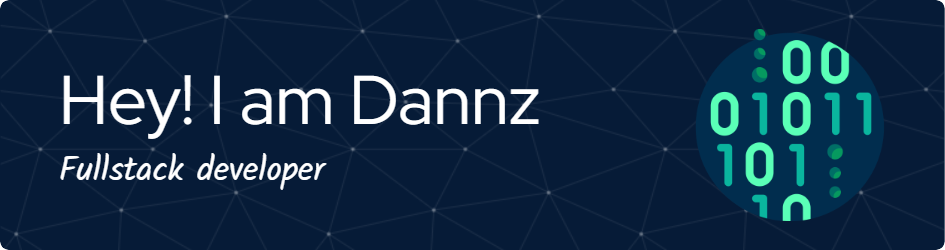
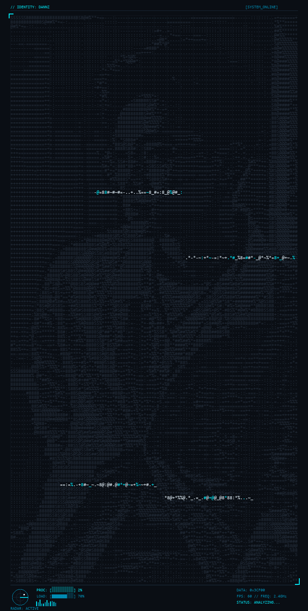
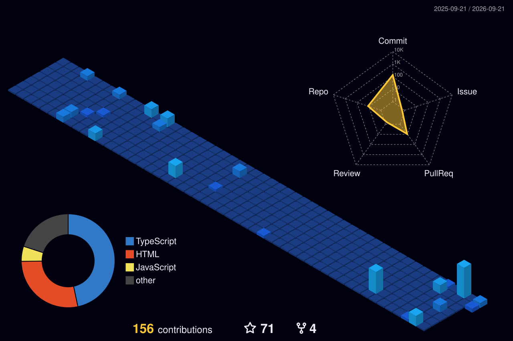

  

<h1 align="center">👋 Hi there! I'm Dannz 🖥️</h1>
<h3 align="center">🚀 AI Engineer | Fullstack & Security Enthusiast | Always Building Something New</h3>

  

  

---

## 🙋‍♂️ About Me

- 🔭 Currently focusing on **Artificial Intelligence, Security, and Web Architecture**.
- 🛠️ Building high-performance, clean, and ready-to-run systems.
- 💬 Ask me about **AI, Linux customization, Cybersecurity (Pentesting), and Math/Logic**.
- 📫 How to reach me: [GitHub Profile](https://github.com/dannz510) | [CodePen](https://codepen.io/dannz510)

---

## 💻 Tech Stack & Tools

### 🌐 Development & Core Languages

### 🕵️‍♂️ Security & Pentesting

---

## 📑 Featured Projects

| Project Name | Description | Link |
| :--- | :--- | :---: |
| **A.Z.O.Z** | AI Assistant System | [🔗](https://github.com/dannz510/A.Z.O.Z) |
| **Python Game Master** | Full-stack games built with pure Python | [🔗](https://github.com/dannz510/PYTHON-GAME-MASTER) |
| **iPhone 15 Simulator** | Interactive web simulator | [🔗](https://github.com/dannz510/Iphone-15-simulator) |
| **Dino Game** | Interactive game project | [🔗](https://github.com/dannz510/DinoGame) |

---

## 📊 Analytics & Activity Graph

  

  

| ⚡ GitHub Streak | 📈 Stats Overview |
| :---: | :---: |
|  |  |

---

## ⌨️ Typing Benchmark

  

---

  

