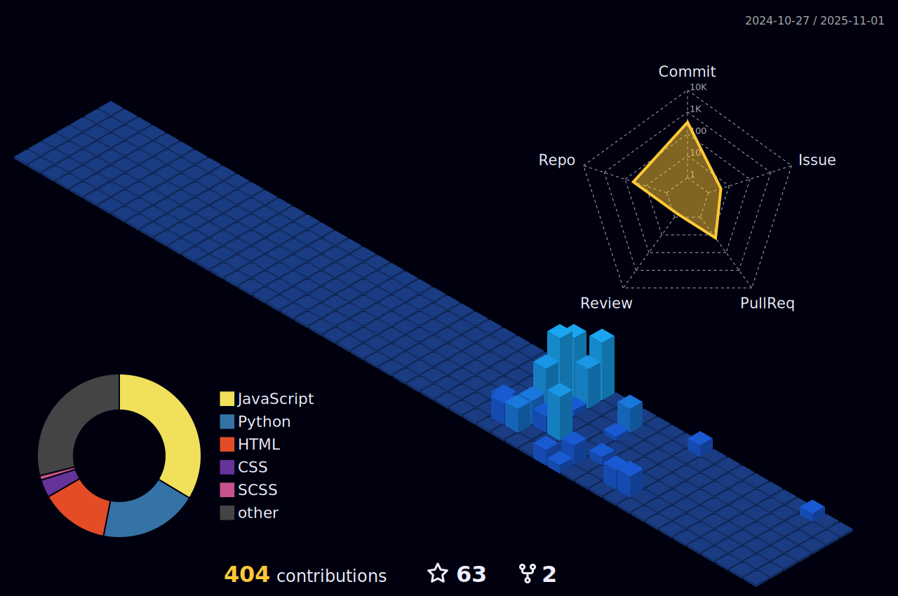

 

 
 <h1 align="center">👋 Hi there! I'm Dannz! 🖥️</h1>

<h3 align="center">🚀 Exploring GitHub | Eager to Learn & Collaborate | Always Building Something New</h3>

  

---

## 🐾 My Profile Visitors

 
  

---

### My GitHub Activity Graph

---
## 🧊 My 3D Contribution Graph

  

---

 

  
  

---
## 🏅 My GitHub Achievements

 
  

---

## 📔 Quote

## 🙋‍♂️ About Me

- 🔭 I’m currently **diving deep into GitHub** and **learning new programming concepts**.

- 🌱 I’m currently learning **[Your primary programming language/technology, e.g., Python, JavaScript, Web Development basics]**

- 👯 I’m looking to collaborate on **beginner-friendly projects** and **learn from experienced developers**.

- 💬 Ask me about **[Topics you're learning or interested in, e.g., getting started with Git, basic coding challenges]**

- 📫 How to reach me: [GitHub profile: Dannz](https://github.com/dannz510)

- ⚡ Fun fact: I'm excited to **build my first [type of project, e.g., web app, script]** and **contribute to open source!**

---

## 💻Use to Code

 

 

 

   
  
  
   
   
  
  
  
   

   
  
   
  
  
  
  
  
  

## 🕵️‍♂️ Use to Hack

---

## 🌓 Moon

---

## 🎧 My Spotify Activity

---

## 📑 My Projects Zone

| Type             | Project Name                      | Link                                                                        |
|------------------|-----------------------------------|-----------------------------------------------------------------------------|
| 🌐 Beginner      | My First HTML Page                | [🔗](https://github.com/dannz510/Heart-by-dz)                               |
| 🌐 Learning      | Simple Chatbot assistant          | [🔗](https://github.com/dannz510/A.Z.O.Z)                                   |
| 🌐 Practice      | Markdown Practice Repository      | [🔗](https://github.com/dannz510/DinoGame)                                  |
| 🌐 Python_Master | Full stack games by python        | [🔗](https://github.com/dannz510/PYTHON-GAME-MASTER)                        |
| 🌐 Website_Master| Iphone simulator online           | [🔗](https://github.com/dannz510/Iphone-15-simulator)                       |

---

## 🔥 GitHub Streak

 |  |
| ------------- | ------------- |

---

## 📊 My GitHub Stats

 |  |
| ------------- | ------------- |

---

## 🚀 Valuable Learning Resources

|  |  |
| ------------- | ------------- |

---
## 📫 Connect With Me

🌠**Github:** [Dannz](https://github.com/dannz510)  
🔠**Codepen:** [@dannz510](https://codepen.io/dannz510)  

---
